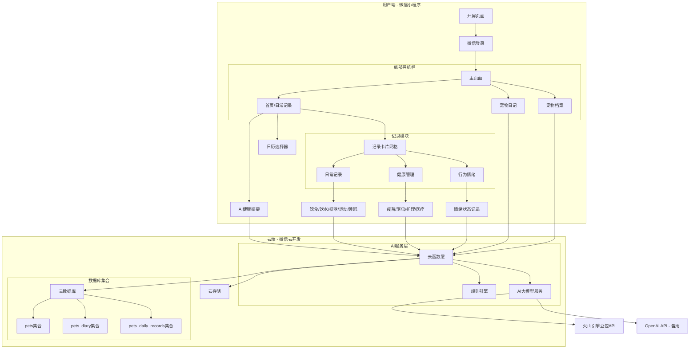
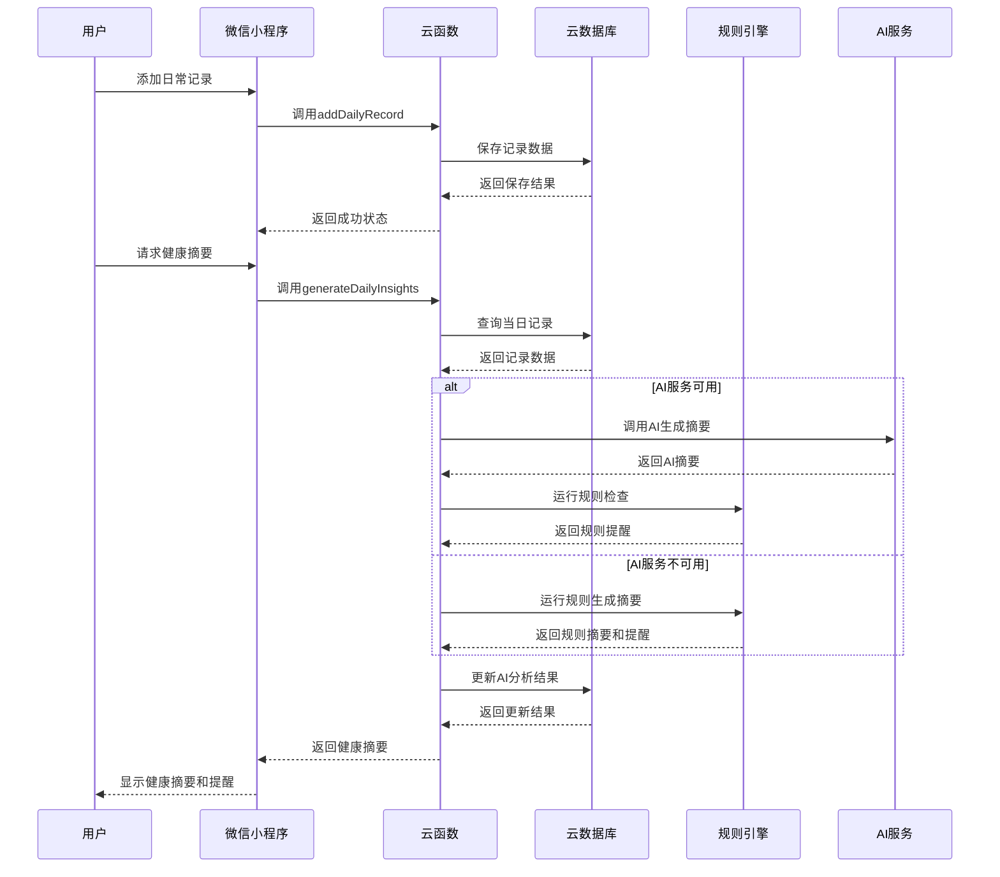
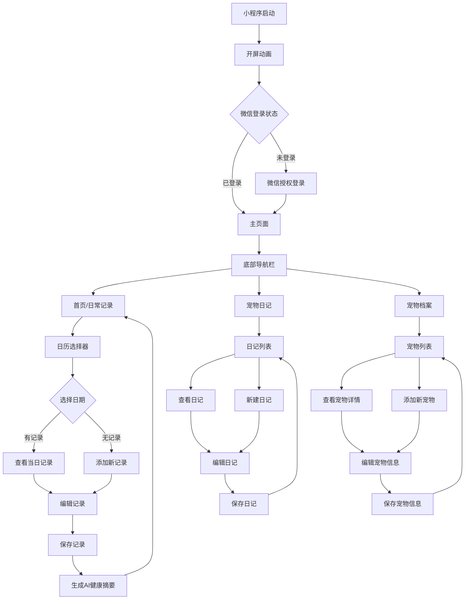

# 宠物日常记录小程序 - 完整项目PRD

## 文档信息
- **文档版本**: v2.0
- **创建日期**: 2026-03-28
- **最后更新**: 2026-03-28
- **项目状态**: 已开发完成，具备上线条件
- **负责人**: 产品团队 + 技术团队

## 1. 项目概述

### 1.1 项目名称
宠物日常记录助手 (Pet Daily Tracker)

### 1.2 项目定位
一款面向养宠人士的轻量化微信小程序，专注于宠物日常行为、健康管理和情感记录的数字化工具。通过AI智能分析和温馨的用户体验，帮助宠物主人更好地了解和照顾宠物。

### 1.3 核心价值
- **简化记录**: 通过直观的界面快速记录宠物日常状态
- **健康管理**: 系统化跟踪宠物健康指标和医疗记录
- **情感连接**: 记录宠物情绪变化，增强主人与宠物的情感纽带
- **智能分析**: 基于AI技术提供健康摘要和异常提醒
- **数据沉淀**: 为宠物建立完整的数字档案，便于长期健康管理

### 1.4 设计原则
- **轻量化**: 核心功能优先，快速加载，简洁界面
- **温馨可爱**: 低饱和度温暖配色，细小字体，圆角卡片设计
- **易用性**: 直观的操作流程，减少用户学习成本
- **智能化**: 结合规则引擎和AI大模型，提供智能健康分析

## 2. 目标用户

### 2.1 用户画像
- **养宠人士**: 饲养猫、狗等常见宠物的主人
- **关注细节**: 注重宠物日常状态和健康管理的细心主人
- **记录习惯**: 有记录宠物成长和健康需求的用户
- **多宠家庭**: 同时饲养多只宠物的家庭
- **科技接受度高**: 愿意使用数字化工具管理宠物生活的用户

### 2.2 使用场景
1. **日常记录**: 每天记录宠物的饮食、排泄、运动等基本情况
2. **健康跟踪**: 记录疫苗接种、驱虫、医疗就诊等重要健康事件
3. **情绪观察**: 记录宠物情绪变化，了解宠物心理状态
4. **成长记录**: 通过日记形式记录宠物成长点滴
5. **健康分析**: 查看AI生成的健康摘要和异常提醒

## 3. 功能需求

### 3.1 核心功能模块

#### 3.1.1 用户系统
- **微信一键登录**: 集成微信授权登录，获取用户信息和openid
- **用户状态管理**: 全局用户状态维护，支持本地存储恢复
- **退出登录**: 完整的退出登录流程，清除所有用户数据

#### 3.1.2 宠物管理模块
- **多宠物支持**: 一个账户可管理多只宠物
- **宠物档案**: 完整的宠物信息记录（名称、类型、品种、性别、生日、体重等）
- **宠物切换**: 可在不同宠物间快速切换
- **宠物添加/编辑**: 支持添加新宠物和编辑现有宠物信息
- **宠物删除**: 支持删除宠物及相关所有记录

#### 3.1.3 日常记录模块 (Daily Routine)
- **饮食记录**: 主粮、零食、罐头、加餐类型，分量记录（克/碗）
- **饮水情况**: 正常、偏多、偏少、未饮水状态记录
- **排泄观察**: 便便状态（正常、拉稀、便秘、带血），尿尿状态（正常、频繁、闭尿、乱尿）
- **户外运动**: 遛宠时长（分钟），运动强度（疯狂跑跳、散步、社交）
- **睡眠质量**: 睡眠时长（小时），表现（深睡、易惊醒、打呼）

#### 3.1.4 健康管理模块 (Medical & Care)
- **预防医疗**: 疫苗记录（狂犬疫苗、联苗），驱虫记录（体内、体外）
- **日常护理**: 清洁（洗澡、剪指甲、清理耳朵、刷牙），美容（理发、造型）
- **医疗记录**: 就诊记录（医院、病因、处方、医嘱），用药记录（药品、频次、剂量）

#### 3.1.5 行为与情绪模块 (Behavior & Mood)
- **情绪天气**: 开心、好奇、愤怒、焦虑、胆小、Emo等情绪状态记录
- **快速记录**: 一键记录当前情绪状态

#### 3.1.6 宠物日记模块
- **文字记录**: 支持富文本日记记录
- **图片上传**: 支持上传宠物照片
- **时间轴展示**: 按时间顺序展示所有日记
- **情绪标签**: 为每篇日记添加情绪标签
- **日记管理**: 支持编辑和删除日记

#### 3.1.7 智能分析模块 (AI-Powered)
- **健康摘要生成**: 基于日常记录生成全面的健康摘要
- **异常提醒**: 识别异常情况并提供提醒建议
- **多源分析**: 结合规则引擎和AI大模型的双重分析
- **趋势分析**: 基于历史数据的趋势识别

### 3.2 辅助功能
- **日历视图**: 水平滚动日历，按日期查看历史记录
- **数据同步**: 云端数据同步，支持多设备访问
- **离线支持**: 网络不可用时自动保存到本地，网络恢复后自动同步
- **数据备份**: 完整的本地数据备份和恢复机制

## 4. 用户界面设计

### 4.1 视觉风格
- **配色方案**: 低饱和度温暖色调，柔和舒适
- **字体设计**: 细小字体，增强画面呼吸感
- **圆角设计**: 所有卡片、按钮均采用圆角设计
- **图标系统**: 简洁明了的图标，增强识别性
- **动效设计**: 适度的交互动画，提升用户体验

### 4.2 页面结构

#### 4.2.1 开屏页面 (Splash)
- 温馨可爱的开屏动画
- 爪子印Logo
- 点击进入主视图

#### 4.2.2 授权登录页面 (Auth)
- 微信授权登录按钮
- 用户隐私协议说明
- 登录状态恢复

#### 4.2.3 主视图（底部导航栏）
- **首页（日常记录）**:
  - Hero标题区：主标题 + 副标题
  - 水平日历选择器：月份切换 + 日期卡片
  - 记录卡片网格：双列并排布局，三个核心功能模块
  - 模块分割：灰色分割线区分不同模块
  - AI健康摘要：显示当日健康摘要和异常提醒

- **宠物日记页**:
  - 日记创建入口
  - 时间轴展示所有日记
  - 图片上传功能
  - 情绪标签选择

- **宠物档案页**:
  - 宠物列表展示
  - 宠物详细信息
  - 添加/编辑宠物功能
  - 宠物切换功能

### 4.3 交互设计
- **快速记录**: 点击网格卡片快速记录
- **详细记录**: 从底部弹出详细记录页面
- **日期切换**: 水平滑动切换日期
- **宠物切换**: 在档案页快速切换当前宠物
- **智能提示**: AI分析结果的视觉提示

## 5. 技术架构

### 5.1 前端技术栈
- **框架**: 微信小程序原生开发
- **UI组件**: 自定义组件 + 微信原生组件
- **状态管理**: 小程序Page data + 全局状态管理
- **数据同步**: 自定义数据同步工具 (utils/dataSync.js)
- **本地存储**: 微信小程序本地存储API

### 5.2 后端技术栈
- **云开发**: 微信云开发（云函数 + 云数据库 + 云存储）
- **数据库**: 云数据库集合：
  - `pets`: 宠物基本信息
  - `pets_diary`: 宠物日记记录
  - `pets_daily_records`: 日常记录数据（包含AI分析结果）
- **云函数**: `petFunctions` 处理所有宠物相关操作

### 5.3 AI集成架构
- **AI服务**: 火山引擎豆包大模型 (Doubao API)
- **备用方案**: OpenAI API (GPT-3.5/4)
- **分析策略**: 规则引擎 + AI大模型双重分析
- **降级机制**: AI服务不可用时自动降级到规则引擎
- **提示词优化**: 结构化提示词确保全面分析

### 5.4 数据模型设计

#### 5.4.1 pets集合结构
```javascript
{
  _id: "宠物ID",
  owner_openid: "用户openid",
  name: "宠物名称",
  type: "宠物类型（猫/狗等）",
  breed: "品种",
  birthday: "出生日期",
  weight: "体重",
  gender: "性别",
  avatar: "头像URL",
  created_at: "创建时间",
  updated_at: "更新时间"
}
```

#### 5.4.2 pets_diary集合结构
```javascript
{
  _id: "日记ID",
  pet_id: "宠物ID",
  owner_openid: "用户openid",
  date: "日记日期",
  title: "日记标题",
  content: "日记内容",
  images: ["图片URL数组"],
  mood: "情绪状态",
  created_at: "创建时间"
}
```

#### 5.4.3 pets_daily_records集合结构
```javascript
{
  _id: "记录ID",
  pet_id: "宠物ID",
  owner_openid: "用户openid",
  date: "记录日期",
  
  // 日常记录
  feeding: {
    type: "饮食类型",
    amount: "分量",
    unit: "单位"
  },
  hydration: {
    status: "饮水状态"
  },
  excretion: {
    poopStatus: "便便状态",
    peeStatus: "尿尿状态"
  },
  activity: {
    duration: "时长",
    intensity: "强度"
  },
  sleep: {
    duration: "时长",
    quality: "质量"
  },
  
  // 健康管理
  medical: {
    vaccines: ["疫苗记录"],
    deworming: ["驱虫记录"],
    grooming: ["护理记录"],
    veterinary: ["就诊记录"]
  },
  
  // 情绪记录
  mood: {
    mood: "情绪状态"
  },
  
  // AI分析结果
  ai_summary: "AI生成的健康摘要",
  ai_summary_source: "ai或rule",
  ai_summary_updated_at: "AI摘要更新时间",
  alerts: ["异常提醒数组"],
  alert_level: "normal或warning",
  alert_source: "ai、rule或ai+rule",
  
  created_at: "创建时间",
  updated_at: "更新时间"
}
```

## 6. 系统架构图

### 6.1 整体系统架构



### 6.2 数据流架构



### 6.3 页面导航流程



## 7. 系统流程

### 7.1 用户注册登录流程
```
用户打开小程序 → 开屏动画 → 微信授权登录 → 获取用户openid → 
检查本地缓存 → 恢复用户状态 → 进入主页面
```

### 7.2 日常记录流程
```
选择日期 → 查看当日记录 → 点击记录卡片 → 弹出详细记录页 → 
填写记录 → 保存 → 触发AI分析 → 更新日历状态 → 显示健康摘要
```

### 7.3 AI分析流程
```
用户保存记录 → 云函数查询当日记录 → 尝试调用AI服务 → 
AI服务可用: 生成AI摘要 + 规则检查 → 合并结果
AI服务不可用: 使用规则引擎生成摘要 → 保存分析结果 → 返回前端
```

### 7.4 数据同步流程
```
用户操作 → 检查网络状态 → 在线: 直接同步到云端 → 
离线: 保存到本地待同步队列 → 网络恢复: 自动同步队列数据 → 
冲突处理: 时间戳优先策略
```

## 8. AI集成详细设计

### 8.1 AI服务架构
- **主AI服务**: 火山引擎豆包大模型 (Doubao)
- **备用AI服务**: OpenAI GPT-3.5/4
- **降级策略**: AI服务不可用时自动降级到规则引擎
- **健康检查**: 定期检查AI服务可用性

### 8.2 提示词优化设计
- **结构化提示**: 强制AI涵盖所有已记录的项目
- **示例引导**: 提供示例输出引导AI生成格式
- **系统角色**: 强化AI的宠物健康助手角色
- **输出约束**: 严格的JSON输出格式要求

### 8.3 错误处理机制
- **重试策略**: AI调用失败时自动重试
- **超时处理**: 设置合理的API调用超时时间
- **降级处理**: AI服务完全不可用时使用规则引擎
- **日志记录**: 详细的AI调用日志便于排查问题

### 8.4 性能优化
- **结果缓存**: 缓存AI分析结果，减少重复调用
- **批量处理**: 支持批量记录分析
- **异步处理**: 异步调用AI服务，不阻塞用户操作

## 9. 非功能需求

### 9.1 性能要求
- **加载速度**: 首屏加载时间 < 2秒
- **响应时间**: 用户操作响应 < 300ms
- **数据同步**: 云端数据同步延迟 < 1秒
- **AI分析响应**: AI摘要生成时间 < 3秒

### 9.2 可用性要求
- **兼容性**: 支持微信iOS/Android最新版本
- **稳定性**: 月崩溃率 < 0.1%
- **可访问性**: 符合微信小程序无障碍标准
- **离线可用**: 支持完整的离线记录功能

### 9.3 安全性要求
- **数据安全**: 用户数据加密存储
- **权限控制**: 用户只能访问自己的宠物数据
- **API安全**: 云函数接口权限验证
- **隐私保护**: 符合微信小程序隐私政策要求

### 9.4 可维护性要求
- **代码规范**: 遵循微信小程序开发规范
- **文档完整**: 提供完整的API文档和代码注释
- **监控告警**: 关键业务指标监控和告警
- **日志记录**: 完整的操作日志和错误日志

## 10. 项目里程碑

### 10.1 已完成里程碑
- **Phase 0: 需求分析与设计** (2026-03-24)
  - 完成产品需求文档
  - 完成UI/UX设计
  - 完成技术架构设计

- **Phase 1: MVP版本开发** (2026-03-24)
  - 基础框架搭建
  - 用户登录系统
  - 宠物档案管理
  - 日常记录核心功能
  - 基础UI界面

- **Phase 2: 功能完善** (2026-03-24)
  - 宠物日记功能
  - 日历视图优化
  - 数据同步机制
  - UI细节优化
  - AI集成基础框架

- **Phase 3: AI集成与优化** (2026-03-27)
  - 火山引擎豆包API集成
  - 规则引擎开发
  - AI提示词优化
  - 错误处理和降级机制
  - 前端AI状态显示

### 10.2 当前项目状态
✅ **核心功能**: 已完成所有核心功能开发
✅ **UI/UX**: 已完成视觉设计和用户体验优化
✅ **数据同步**: 已完成云端同步和离线支持
✅ **AI集成**: 已完成技术集成，等待API配置修复
✅ **测试验证**: 已完成基础功能测试
🚀 **上线准备**: 项目已具备上线运行条件

### 10.3 未来规划

#### 短期优化（1-2周）
1. **AI服务修复**: 修复火山引擎API配置问题
2. **数据可视化**: 添加图表展示宠物健康趋势
3. **提醒功能**: 添加疫苗、驱虫等提醒功能
4. **性能优化**: 进一步优化加载速度和响应时间

#### 中期优化（1-2月）
1. **社区功能**: 添加宠物社交和分享功能
2. **智能分析增强**: 基于历史数据的趋势预测
3. **多端同步**: 支持Web端和App端数据同步
4. **个性化推荐**: 基于宠物特征的个性化建议

#### 长期规划（3-6月）
1. **AI识别增强**: 通过图片识别宠物品种、情绪等
2. **智能硬件集成**: 连接智能喂食器、智能项圈等设备
3. **宠物服务生态**: 集成宠物医院预约、宠物用品商城等服务
4. **多语言支持**: 支持多语言界面

## 11. 风险评估与应对

### 11.1 技术风险
- **云开发限制**: 云数据库查询性能限制
  - 应对：合理设计数据模型，优化查询逻辑，使用索引
- **存储空间**: 用户图片上传占用存储
  - 应对：设置图片大小限制，定期清理策略，使用CDN加速
- **AI服务稳定性**: 第三方AI服务不可用
  - 应对：多AI服务备用，完善的降级机制，本地规则引擎
- **网络依赖**: 强依赖网络连接
  - 应对：完整的离线支持，智能数据同步机制

### 11.2 产品风险
- **用户粘性**: 用户可能记录几天后放弃
  - 应对：设计激励机制，如连续记录奖励、成就系统
- **功能复杂度**: 功能过多导致用户困惑
  - 应对：保持核心功能简洁，渐进式功能展示，良好的新手引导
- **数据准确性**: 用户记录数据可能不准确
  - 应对：提供记录模板，智能数据验证，异常数据提示

### 11.3 运营风险
- **用户增长**: 获取初始用户困难
  - 应对：宠物社区合作，口碑营销，社交媒体推广
- **数据隐私**: 用户对宠物数据隐私的担忧
  - 应对：明确的隐私政策，数据加密，用户数据控制权
- **合规性**: 医疗健康相关功能的合规要求
  - 应对：明确免责声明，不提供医疗诊断，仅提供健康记录功能

## 12. 成功指标

### 12.1 用户指标
- **日活跃用户 (DAU)**: 目标1000+
- **用户留存率**: 7日留存 > 30%，30日留存 > 15%
- **记录完成率**: 每日记录完成率 > 40%
- **宠物数量**: 平均每个用户宠物数 > 1.2
- **用户满意度**: 用户评分 > 4.5/5

### 12.2 产品指标
- **功能使用率**: 各功能模块使用分布
  - 日常记录使用率 > 60%
  - 宠物日记使用率 > 30%
  - AI摘要查看率 > 50%
- **性能指标**:
  - 页面加载成功率 > 99.5%
  - API响应时间 P95 < 500ms
- **数据质量**:
  - 平均每日记录完整性 > 70%
  - 数据同步成功率 > 99%

### 12.3 技术指标
- **系统可用性**: 系统可用性 > 99.9%
- **错误率**: 严重错误率 < 0.1%
- **AI服务可用性**: AI服务可用性 > 95%
- **数据安全性**: 安全漏洞数量 = 0

## 13. 部署与运维

### 13.1 部署架构
- **前端部署**: 微信小程序平台自动部署
- **后端部署**: 微信云开发自动部署
- **数据库**: 微信云数据库自动管理
- **存储**: 微信云存储自动扩展

### 13.2 监控告警
- **业务监控**: 用户活跃、记录数量、错误率等
- **性能监控**: API响应时间、页面加载时间、资源使用率
- **AI服务监控**: AI调用成功率、响应时间、错误类型
- **告警机制**: 关键指标异常时自动告警

### 13.3 运维流程
- **版本发布**: 每周迭代发布，灰度发布策略
- **数据备份**: 每日自动数据备份，保留30天
- **故障处理**: 标准故障处理流程，SLA承诺
- **容量规划**: 基于用户增长预测的容量规划

## 14. 项目团队与职责

### 14.1 核心团队
- **产品经理**: 需求分析、产品规划、用户体验
- **UI/UX设计师**: 界面设计、交互设计、视觉规范
- **前端开发**: 微信小程序开发、前端架构
- **后端开发**: 云函数开发、数据库设计、API设计
- **AI工程师**: AI集成、提示词优化、算法开发
- **测试工程师**: 功能测试、性能测试、兼容性测试

### 14.2 协作流程
- **敏捷开发**: 两周一个迭代周期
- **代码管理**: Git代码仓库，分支管理策略
- **文档管理**: 统一的文档管理系统
- **沟通协作**: 每日站会，每周迭代评审

## 15. 附录

### 15.1 项目文件结构
```
d:/FurForever/
├── FULL_PROJECT_PRD.md          # 完整产品需求文档
├── PROJECT_SUMMARY.md           # 项目总结文档
├── plans/宠物记录小程序PRD.md   # 原始PRD文档
├── plans/AI集成问题分析.md      # AI集成问题分析
├── plans/AI集成修复方案.md      # AI集成修复方案
├── plans/AI提示词优化方案.md    # AI提示词优化方案
├── plans/规则推理与AI生成切换逻辑分析.md
├── project.config.json          # 小程序项目配置
├── project.private.config.json  # 私有配置
├── README.md                    # 项目说明
├── uploadCloudFunction.sh       # 云函数上传脚本
├── test_ai_summary.js           # AI摘要测试脚本
├── test_data_integrity.js       # 数据完整性测试
├── test_optimized_prompt.js     # 优化提示词测试
├── test_record_merge.js         # 记录合并测试
├── cloudfunctions/              # 云函数目录
│   ├── quickstartFunctions/     # 原有云函数
│   └── petFunctions/            # 宠物管理云函数
│       ├── config.json
│       ├── index.js             # 主逻辑文件（包含AI集成）
│       └── package.json
└── miniprogram/                 # 小程序前端
    ├── app.js                   # 小程序入口
    ├── app.json                 # 全局配置
    ├── app.wxss                 # 全局样式
    ├── envList.js               # 环境配置
    ├── sitemap.json             # 站点地图
    ├── utils/dataSync.js        # 数据同步工具
    ├── components/              # 组件目录
    ├── images/                  # 图片资源
    └── pages/                   # 页面目录
        ├── splash/              # 开屏页面
        ├── auth/                # 授权页面
        ├── home/                # 首页/日常记录
        ├── diary/               # 宠物日记
        └── profile/             # 个人中心/宠物档案
```

### 15.2 技术依赖
- **微信小程序基础库**: >= 2.2.3
- **微信云开发**: 最新版本
- **火山引擎豆包API**: 需要有效的API密钥
- **OpenAI API**: 备用AI服务（可选）
- **Node.js**: 云函数运行环境

### 15.3 开发环境
- **开发工具**: VS Code + 微信开发者工具
- **版本控制**: Git
- **包管理**: npm
- **测试工具**: 微信开发者工具模拟器

### 15.4 相关文档
- [微信小程序开发文档](https://developers.weixin.qq.com/miniprogram/dev/framework/)
- [微信云开发文档](https://developers.weixin.qq.com/miniprogram/dev/wxcloud/basis/getting-started.html)
- [火山引擎豆包API文档](https://www.volcengine.com/docs/82379)
- [OpenAI API文档](https://platform.openai.com/docs/api-reference)

## 16. 版本历史

| 版本 | 日期 | 作者 | 说明 |
|------|------|------|------|
| v1.0 | 2026-03-24 | 产品团队 | 初始PRD版本 |
| v2.0 | 2026-03-28 | Roo | 完整项目PRD，包含AI集成、技术架构、项目状态等 |

---

**文档状态**: 已完成
**评审状态**: 待评审
**下一步行动**: 团队评审后进入下一阶段规划

---