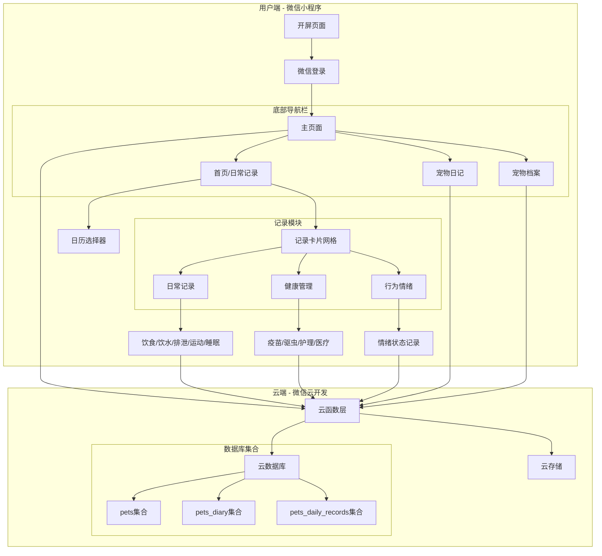
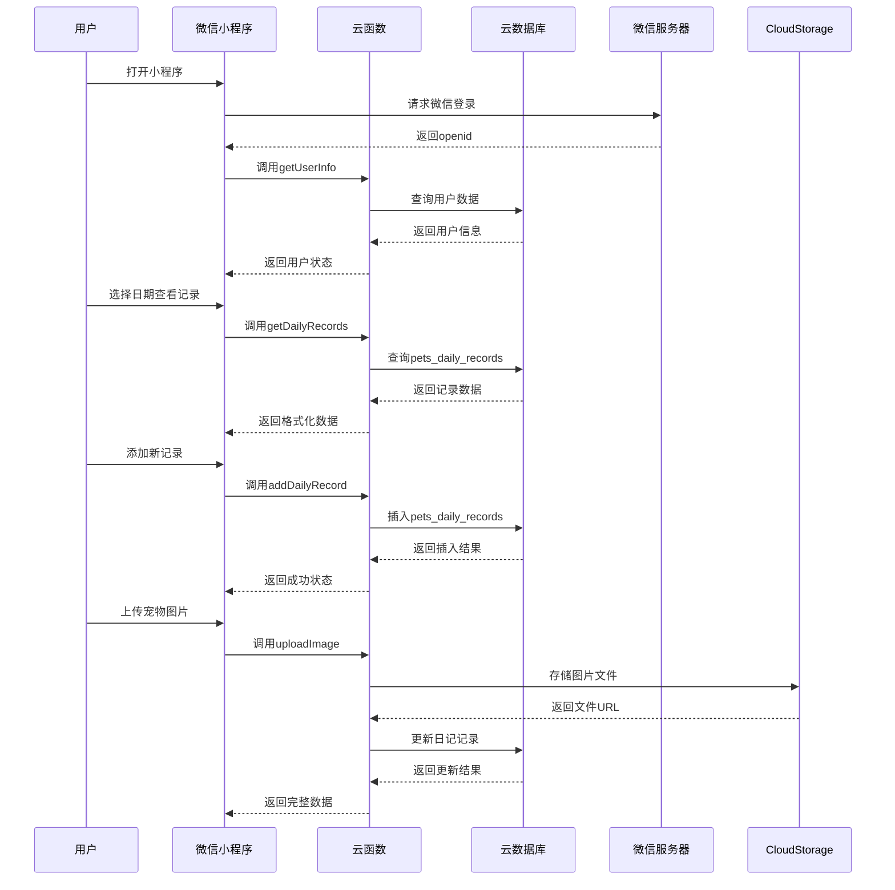
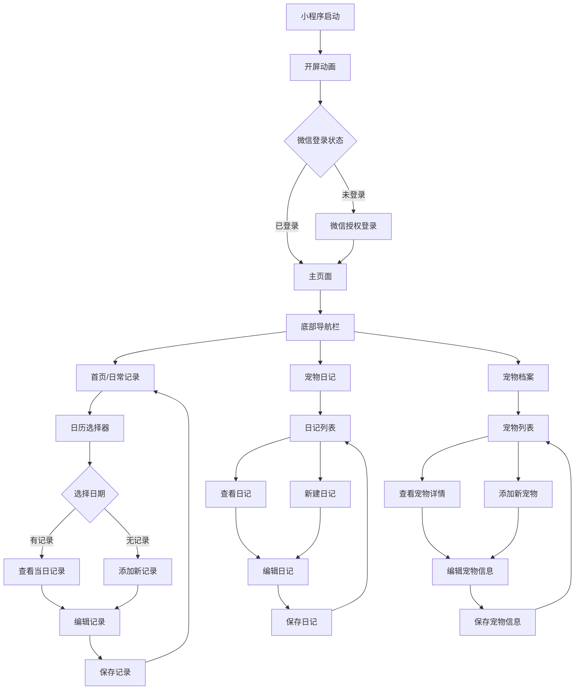

# 宠物日常记录小程序 - 产品需求文档 (PRD)

## 1. 项目概述

### 1.1 项目名称
宠物日常记录助手 (Pet Daily Tracker)

### 1.2 项目定位
一款面向养宠人士的轻量化微信小程序，专注于宠物日常行为、健康管理和情感记录的数字化工具。

### 1.3 核心价值
- **简化记录**：通过直观的界面快速记录宠物日常状态
- **健康管理**：系统化跟踪宠物健康指标和医疗记录
- **情感连接**：记录宠物情绪变化，增强主人与宠物的情感纽带
- **数据沉淀**：为宠物建立完整的数字档案，便于长期健康管理

### 1.4 设计原则
- **轻量化**：核心功能优先，快速加载，简洁界面
- **温馨可爱**：低饱和度温暖配色，细小字体，圆角卡片设计
- **易用性**：直观的操作流程，减少用户学习成本

## 2. 目标用户

### 2.1 用户画像
- **养宠人士**：饲养猫、狗等常见宠物的主人
- **关注细节**：注重宠物日常状态和健康管理的细心主人
- **记录习惯**：有记录宠物成长和健康需求的用户
- **多宠家庭**：同时饲养多只宠物的家庭

### 2.2 使用场景
1. **日常记录**：每天记录宠物的饮食、排泄、运动等基本情况
2. **健康跟踪**：记录疫苗接种、驱虫、医疗就诊等重要健康事件
3. **情绪观察**：记录宠物情绪变化，了解宠物心理状态
4. **成长记录**：通过日记形式记录宠物成长点滴

## 3. 功能需求

### 3.1 核心功能模块

#### 3.1.1 日常记录模块 (Daily Routine)
- **饮食记录**：主粮、零食、罐头、加餐类型，分量记录（克/碗）
- **饮水情况**：正常、偏多、偏少、未饮水状态记录
- **排泄观察**：便便状态（正常、拉稀、便秘、带血），尿尿状态（正常、频繁、闭尿、乱尿）
- **户外运动**：遛宠时长（分钟），运动强度（疯狂跑跳、散步、社交）
- **睡眠质量**：睡眠时长（小时），表现（深睡、易惊醒、打呼）

#### 3.1.2 健康管理模块 (Medical & Care)
- **预防医疗**：疫苗记录（狂犬疫苗、联苗），驱虫记录（体内、体外）
- **日常护理**：清洁（洗澡、剪指甲、清理耳朵、刷牙），美容（理发、造型）
- **医疗记录**：就诊记录（医院、病因、处方、医嘱），用药记录（药品、频次、剂量）

#### 3.1.3 行为与情绪模块 (Behavior & Mood)
- **情绪天气**：开心、好奇、愤怒、焦虑、胆小、Emo等情绪状态记录

#### 3.1.4 宠物日记模块
- **文字记录**：支持富文本日记记录
- **图片上传**：支持上传宠物照片
- **时间轴展示**：按时间顺序展示所有日记

#### 3.1.5 宠物档案模块
- **多宠物支持**：一个账户可管理多只宠物
- **基本信息**：品种、体重、年龄、性别、生日等
- **宠物切换**：可在不同宠物间切换

### 3.2 辅助功能
- **日历视图**：水平滚动日历，按日期查看历史记录
- **数据同步**：云端数据同步，支持多设备访问
- **微信登录**：一键微信登录，简化注册流程

## 4. 用户界面设计

### 4.1 视觉风格
- **配色方案**：低饱和度温暖色调，柔和舒适
- **字体设计**：细小字体，增强画面呼吸感
- **圆角设计**：所有卡片、按钮均采用圆角设计
- **图标系统**：简洁明了的图标，增强识别性

### 4.2 页面结构

#### 4.2.1 开屏页面
- 温馨可爱的开屏动画
- 爪子印Logo
- 点击进入主视图

#### 4.2.2 主视图（底部导航栏）
- **首页（日常记录）**：
  - Hero标题区：主标题 + 副标题
  - 水平日历选择器：月份切换 + 日期卡片
  - 记录卡片网格：双列并排布局，三个核心功能模块
  - 模块分割：灰色分割线区分不同模块

- **宠物日记页**：
  - 日记创建入口
  - 时间轴展示所有日记
  - 图片上传功能

- **宠物档案页**：
  - 宠物列表展示
  - 宠物详细信息
  - 添加/编辑宠物功能

### 4.3 交互设计
- **快速记录**：点击网格卡片快速记录
- **详细记录**：从底部弹出详细记录页面
- **日期切换**：水平滑动切换日期
- **宠物切换**：在档案页快速切换当前宠物

## 5. 技术架构

### 5.1 前端技术栈
- **框架**：微信小程序原生开发
- **UI组件**：自定义组件 + 微信原生组件
- **状态管理**：小程序Page data + 全局状态

### 5.2 后端技术栈
- **云开发**：微信云开发（云函数 + 云数据库 + 云存储）
- **数据库**：云数据库集合：
  - `pets`：宠物基本信息
  - `pets_diary`：宠物日记记录
  - `pets_daily_records`：日常记录数据
- **云函数**：业务逻辑处理，数据操作接口

### 5.3 数据模型设计

#### 5.3.1 pets集合结构
```javascript
{
  _id: "宠物ID",
  owner_openid: "用户openid",
  name: "宠物名称",
  type: "宠物类型（猫/狗等）",
  breed: "品种",
  birthday: "出生日期",
  weight: "体重",
  gender: "性别",
  avatar: "头像URL",
  created_at: "创建时间",
  updated_at: "更新时间"
}
```

#### 5.3.2 pets_diary集合结构
```javascript
{
  _id: "日记ID",
  pet_id: "宠物ID",
  owner_openid: "用户openid",
  date: "日记日期",
  title: "日记标题",
  content: "日记内容",
  images: ["图片URL数组"],
  mood: "情绪状态",
  created_at: "创建时间"
}
```

#### 5.3.3 pets_daily_records集合结构（建议新增）
```javascript
{
  _id: "记录ID",
  pet_id: "宠物ID",
  owner_openid: "用户openid",
  date: "记录日期",
  // 日常记录
  feeding: {
    type: "饮食类型",
    amount: "分量",
    unit: "单位"
  },
  hydration: "饮水状态",
  excretion: {
    poop: "便便状态",
    urine: "尿尿状态"
  },
  activity: {
    duration: "时长",
    intensity: "强度"
  },
  sleep: {
    duration: "时长",
    quality: "质量"
  },
  // 健康管理
  medical: {
    vaccines: ["疫苗记录"],
    deworming: ["驱虫记录"],
    grooming: ["护理记录"],
    veterinary: ["就诊记录"]
  },
  // 情绪记录
  mood: "情绪状态",
  created_at: "创建时间",
  updated_at: "更新时间"
}
```

## 6. 系统架构图

### 6.1 整体系统架构



### 6.2 数据流架构



### 6.3 页面导航流程



## 7. 系统流程

### 7.1 用户注册登录流程
```
用户打开小程序 → 开屏动画 → 微信授权登录 → 获取用户openid → 进入主页面
```

### 7.2 日常记录流程
```
选择日期 → 查看当日记录 → 点击记录卡片 → 弹出详细记录页 → 填写记录 → 保存 → 更新日历状态
```

### 7.3 宠物管理流程
```
进入宠物档案页 → 查看宠物列表 → 点击添加宠物 → 填写宠物信息 → 保存 → 切换当前宠物
```

## 7. 非功能需求

### 7.1 性能要求
- **加载速度**：首屏加载时间 < 2秒
- **响应时间**：用户操作响应 < 300ms
- **数据同步**：云端数据同步延迟 < 1秒

### 7.2 可用性要求
- **兼容性**：支持微信iOS/Android最新版本
- **稳定性**：月崩溃率 < 0.1%
- **可访问性**：符合微信小程序无障碍标准

### 7.3 安全性要求
- **数据安全**：用户数据加密存储
- **权限控制**：用户只能访问自己的宠物数据
- **API安全**：云函数接口权限验证

## 8. 项目里程碑

### 8.1 Phase 1：MVP版本（4周）
- 基础框架搭建
- 用户登录系统
- 宠物档案管理
- 日常记录核心功能
- 基础UI界面

### 8.2 Phase 2：功能完善（3周）
- 宠物日记功能
- 日历视图优化
- 数据同步机制
- UI细节优化

### 8.3 Phase 3：体验优化（2周）
- 性能优化
- 用户体验测试
- Bug修复
- 发布准备

## 9. 风险评估与应对

### 9.1 技术风险
- **云开发限制**：云数据库查询性能限制
  - 应对：合理设计数据模型，优化查询逻辑
- **存储空间**：用户图片上传占用存储
  - 应对：设置图片大小限制，定期清理策略

### 9.2 产品风险
- **用户粘性**：用户可能记录几天后放弃
  - 应对：设计激励机制，如连续记录奖励
- **功能复杂度**：功能过多导致用户困惑
  - 应对：保持核心功能简洁，逐步迭代

## 10. 成功指标

### 10.1 用户指标
- **日活跃用户**：目标1000+
- **用户留存率**：7日留存 > 30%
- **记录完成率**：每日记录完成率 > 40%

### 10.2 产品指标
- **功能使用率**：各功能模块使用分布
- **用户反馈**：用户评分 > 4.5/5
- **Bug率**：严重Bug数量 < 5个

---

**文档版本**：v1.0  
**创建日期**：2026-03-24  
**最后更新**：2026-03-24  
**负责人**：产品团队