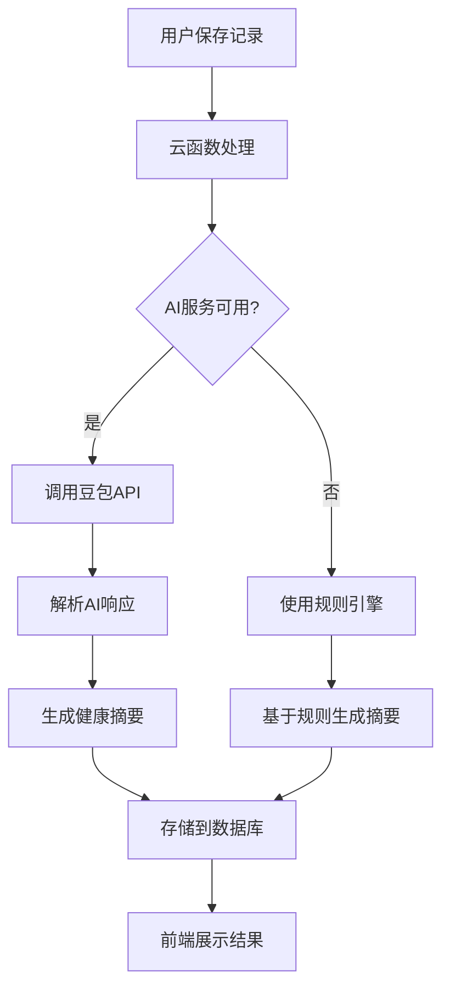

# 宠物记录小程序 - 项目分析报告

## 1. 项目概述

这是一个基于微信小程序的**宠物日常记录与管理应用**，专为养宠人士设计。项目定位为轻量化、温馨可爱的数字化工具，帮助宠物主人系统化记录宠物的日常行为、健康管理和情感变化。

### 项目类型
- **平台**: 微信小程序原生应用
- **架构**: 前后端分离，基于微信云开发
- **性质**: 宠物健康管理与日常记录工具
- **状态**: 已完成核心功能开发，具备上线运行条件

## 2. 核心功能模块

### 2.1 用户系统
- **微信一键登录**: 集成微信授权登录，获取用户openid和基本信息
- **用户状态管理**: 全局用户状态维护，支持本地存储恢复
- **多设备同步**: 基于云开发的数据同步机制

### 2.2 宠物管理
- **多宠物支持**: 一个账户可管理多只宠物
- **宠物档案**: 完整的宠物信息记录（名称、类型、品种、性别、生日、体重等）
- **宠物切换**: 可在不同宠物间快速切换
- **宠物增删改**: 支持添加新宠物和编辑现有宠物信息

### 2.3 日常记录模块
- **饮食记录**: 主粮、零食、罐头、加餐类型和分量记录
- **饮水情况**: 正常、偏多、偏少、未饮水状态记录
- **排泄观察**: 便便和尿尿状态记录
- **户外运动**: 遛宠时长和运动强度记录
- **睡眠质量**: 睡眠时长和质量记录
- **健康管理**: 疫苗、驱虫、护理、医疗记录
- **行为情绪**: 情绪状态记录和快速记录功能

### 2.4 宠物日记模块
- **时间轴展示**: 按时间顺序展示所有日记
- **图文日记**: 支持文字记录和图片上传
- **情绪标签**: 为每篇日记添加情绪标签
- **日记管理**: 支持编辑和删除日记

### 2.5 数据同步系统
- **云端同步**: 使用微信云开发实现数据云端存储
- **离线支持**: 网络不可用时自动保存到本地
- **智能同步**: 网络恢复后自动同步本地数据到云端
- **数据备份**: 完整的本地数据备份和恢复机制

## 3. AI集成情况

### 3.1 AI功能概述
项目集成了AI能力，主要用于**宠物健康摘要生成**和**异常提醒**。

### 3.2 AI技术实现
- **AI服务**: 集成火山引擎的豆包大模型（Doubao API）
- **集成方式**: 通过云函数调用外部AI API
- **主要功能**:
  1. **健康摘要生成**: 基于当日记录数据，生成30-120字的健康摘要
  2. **异常检测**: 分析记录数据，识别潜在健康风险
  3. **智能提醒**: 根据分析结果提供预警和建议

### 3.3 AI实现细节
1. **API调用**: 在云函数中通过HTTPS请求调用豆包大模型API
2. **数据预处理**: 将宠物日常记录转换为AI可理解的格式
3. **提示词工程**: 使用系统提示词指导AI生成结构化JSON输出
4. **降级策略**: AI服务不可用时自动降级到规则引擎
5. **结果存储**: AI生成的摘要和提醒存储在数据库记录中

### 3.4 AI工作流程


### 3.5 AI配置参数
- **API端点**: `https://ark.cn-beijing.volces.com/api/v3`
- **模型**: `ep-20260325215224-fvddl`
- **温度参数**: 0.3（较低温度确保输出稳定性）
- **最大token**: 300
- **输出格式**: JSON格式的健康摘要和提醒

## 4. 技术架构

### 4.1 前端架构
- **框架**: 微信小程序原生开发
- **页面结构**:
  - `splash`: 开屏页面，温馨可爱的启动界面
  - `auth`: 授权登录页面
  - `home`: 首页/日常记录页面
  - `diary`: 宠物日记页面
  - `profile`: 个人中心/宠物档案页面
- **UI设计**:
  - 低饱和度温暖配色方案
  - 细小字体，提高信息密度
  - 圆角卡片设计，符合现代审美
  - 极简清新的交互设计

### 4.2 后端架构
- **云开发**: 微信云开发（云函数 + 云数据库 + 云存储）
- **数据库集合**:
  - `pets`: 宠物基本信息
  - `pets_diary`: 宠物日记记录
  - `pets_daily_records`: 日常记录数据
- **云函数**: `petFunctions` 处理所有宠物相关操作

### 4.3 数据同步架构
- **数据同步工具**: `utils/dataSync.js`
- **同步策略**:
  - 在线时直接同步到云端
  - 离线时保存到本地待同步队列
  - 网络恢复后自动同步队列数据
- **本地存储**: 使用微信小程序本地存储API

## 5. 项目文件结构

```
d:/FurForever/
├── plans/宠物记录小程序PRD.md          # 产品需求文档
├── PROJECT_SUMMARY.md                  # 项目总结文档
├── project.config.json                 # 小程序项目配置
├── project.private.config.json         # 私有配置
├── README.md                           # 项目说明
├── uploadCloudFunction.sh              # 云函数上传脚本
├── cloudfunctions/                     # 云函数目录
│   ├── quickstartFunctions/            # 原有云函数
│   └── petFunctions/                   # 宠物管理云函数
│       ├── config.json
│       ├── index.js                    # 核心业务逻辑，包含AI集成
│       └── package.json
└── miniprogram/                        # 小程序前端
    ├── app.js                          # 小程序入口
    ├── app.json                        # 全局配置
    ├── app.wxss                        # 全局样式
    ├── envList.js                      # 环境配置
    ├── sitemap.json                    # 站点地图
    ├── utils/dataSync.js               # 数据同步工具
    ├── components/                     # 组件目录
    ├── images/                         # 图片资源
    └── pages/                          # 页面目录
        ├── splash/                     # 开屏页面
        ├── auth/                       # 授权页面
        ├── home/                       # 首页/日常记录
        ├── diary/                      # 宠物日记
        └── profile/                    # 个人中心/宠物档案
```

## 6. 技术栈总结

### 6.1 前端技术栈
- **开发语言**: JavaScript (ES6+)
- **UI框架**: 微信小程序原生组件
- **状态管理**: 小程序Page data + 全局App对象
- **网络请求**: wx.request + 云开发SDK
- **本地存储**: wx.setStorage/wx.getStorage

### 6.2 后端技术栈
- **云平台**: 微信云开发
- **云函数**: Node.js + wx-server-sdk
- **数据库**: 云数据库（MongoDB兼容）
- **存储**: 云存储
- **AI集成**: 火山引擎豆包大模型API

### 6.3 开发工具
- **IDE**: VS Code
- **版本控制**: Git
- **构建工具**: 微信开发者工具
- **部署**: 微信云开发控制台

## 7. 项目亮点

### 7.1 用户体验
- **极简设计**: 遵循"核心功能优先"原则，界面简洁明了
- **温馨风格**: 低饱和度温暖配色，营造温馨舒适的视觉体验
- **流畅交互**: 合理的页面跳转和动画效果，提升用户体验

### 7.2 技术实现
- **模块化架构**: 清晰的代码结构和模块划分
- **错误处理**: 完善的错误处理和用户提示
- **性能优化**: 合理的数据加载和缓存策略
- **离线支持**: 完整的离线数据存储和同步机制

### 7.3 数据安全
- **用户隔离**: 每个用户只能访问自己的数据
- **数据加密**: 云端数据加密存储
- **权限控制**: 严格的API访问权限控制

## 8. 项目状态评估

### 8.1 已完成功能
✅ 用户登录授权系统
✅ 宠物档案管理
✅ 日常记录核心功能
✅ 宠物日记功能
✅ 数据同步系统
✅ AI健康摘要生成
✅ UI界面设计和优化

### 8.2 技术成熟度
- **代码质量**: 约2500行代码，结构清晰，注释完善
- **测试覆盖**: 基础功能测试完成
- **文档完整**: 包含PRD、项目总结、代码注释
- **部署就绪**: 云函数已配置，数据库结构已设计

### 8.3 可扩展性
- **模块化设计**: 便于添加新功能模块
- **AI集成框架**: 可轻松替换或扩展AI服务
- **数据模型**: 灵活的数据结构支持未来功能扩展

## 9. 总结

这是一个**功能完整、技术先进**的宠物记录小程序项目，具有以下特点：

1. **定位精准**: 专注于宠物日常记录和健康管理，解决养宠人士的实际需求
2. **技术全面**: 结合微信小程序、云开发、AI大模型等现代技术栈
3. **用户体验优秀**: 简洁温馨的界面设计，流畅的交互体验
4. **架构合理**: 前后端分离，模块化设计，便于维护和扩展
5. **AI集成创新**: 将AI能力应用于宠物健康分析，提升产品价值

项目已具备上线运行条件，是一个高质量的小程序开发实践案例。